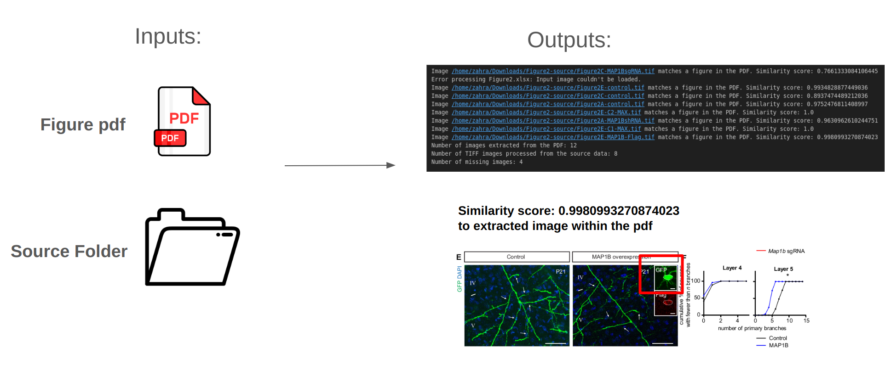

# PDF Image Matcher Documentation

   

      
   

## Overview
PDF Image Matcher allows users to extract images from PDF files and compare these images against a provided template image. This tool utilizes OpenCV and PyMuPDF (fitz) libraries to handle image processing and PDF manipulation respectively. It's especially useful for researchers and professionals who need to analyze visual data embedded in PDFs or validate document contents against a specific image.

## Installation
Prerequisites
Python 3.x
OpenCV
PyMuPDF (fitz)
NumPy
PIL
IPython (for Jupyter Notebook support)
Setup Instructions
Ensure Python is installed on your system. You can download it from python.org.
Install the required Python libraries using pip:
bash
pip install opencv-python-headless numpy PyMuPDF Pillow ipython
Usage
Importing the Module
First, import the module into your Python script or Jupyter notebook:

## Example Usage
python
pdf_path = 'path/to/your/document.pdf'
input_image_path = 'path/to/your/template/image.jpg'
extracted_images = pdf_image_matcher.extract_images_from_pdf(pdf_path)
pdf_image_matcher.match_template_with_extracted_images(input_image_path, extracted_images)
